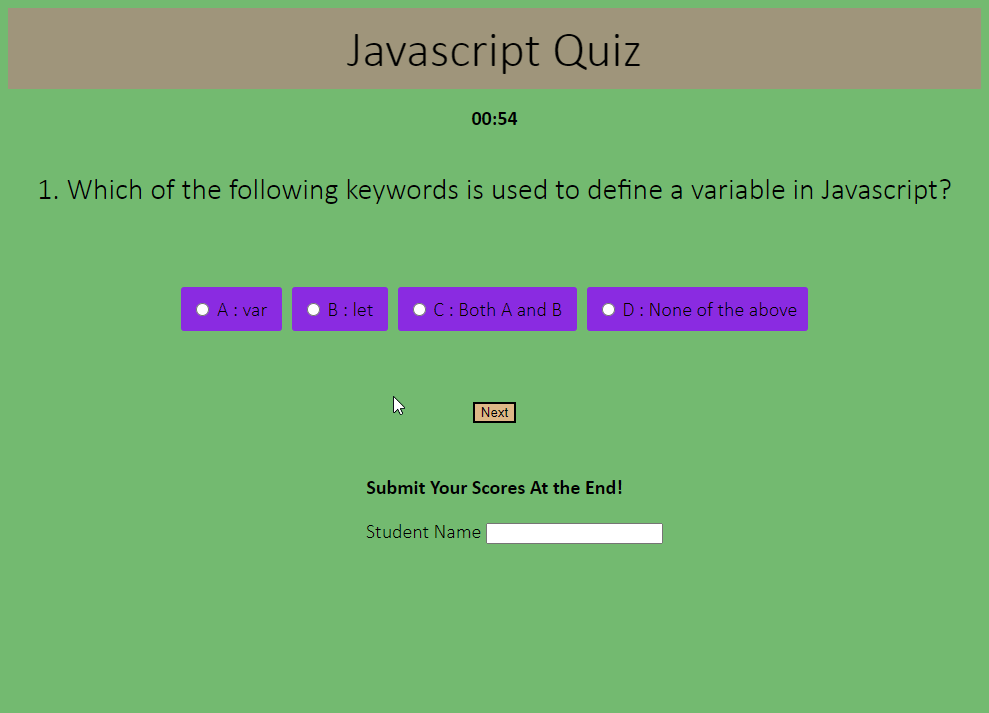

# Quiz-Page
Quiz Page

## Acknowledgments

- [Simple Countdown Timer with JavaScript](https://www.youtube.com/watch?v=x7WJEmxNlEs)

- [How To Create A Quiz App Using JavaScript?](https://www.codingninjas.com/codestudio/library/how-to-create-a-quiz-app-using-javascript)

## Author

- [@MacaroniKetchup](https://github.com/MacaroniKetchup)

## Demo

## Features

- Right and Wrong asnwers will display either blue for correct answers or red for wrong answers at the end of the quiz.

- A one-minute countdown timer function.

- Functioning Previous and Next buttons that can let you go back and forth between queations.

- Hitting the submit quiz button displays total questions correct out of total question amount

## Liscense
MIT License

Copyright (c) 2023 MacaroniKetchup

Permission is hereby granted, free of charge, to any person obtaining a copy
of this software and associated documentation files (the "Software"), to deal
in the Software without restriction, including without limitation the rights
to use, copy, modify, merge, publish, distribute, sublicense, and/or sell
copies of the Software, and to permit persons to whom the Software is
furnished to do so, subject to the following conditions:

The above copyright notice and this permission notice shall be included in all
copies or substantial portions of the Software.

THE SOFTWARE IS PROVIDED "AS IS", WITHOUT WARRANTY OF ANY KIND, EXPRESS OR
IMPLIED, INCLUDING BUT NOT LIMITED TO THE WARRANTIES OF MERCHANTABILITY,
FITNESS FOR A PARTICULAR PURPOSE AND NONINFRINGEMENT. IN NO EVENT SHALL THE
AUTHORS OR COPYRIGHT HOLDERS BE LIABLE FOR ANY CLAIM, DAMAGES OR OTHER
LIABILITY, WHETHER IN AN ACTION OF CONTRACT, TORT OR OTHERWISE, ARISING FROM,
OUT OF OR IN CONNECTION WITH THE SOFTWARE OR THE USE OR OTHER DEALINGS IN THE
SOFTWARE.